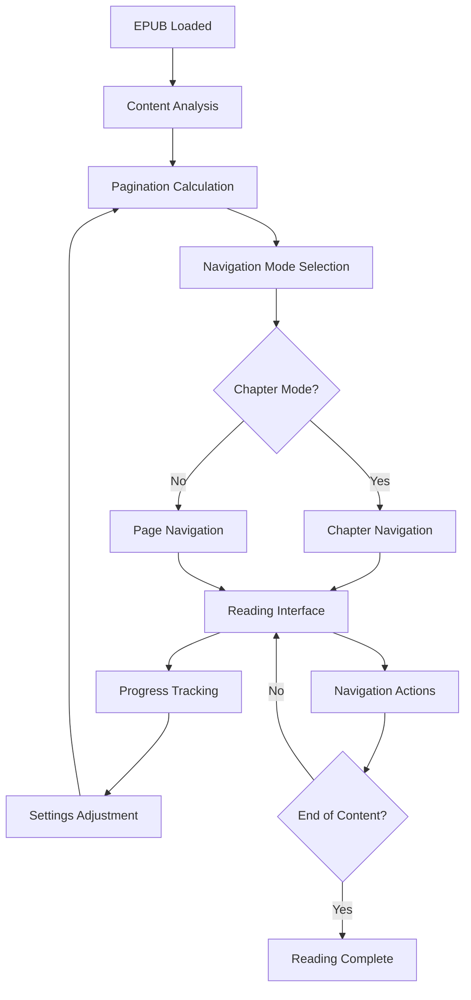

# Advanced Pagination System - Product Requirements Document

## 1. Product Overview

Develop a sophisticated pagination system for nuReader that provides seamless page-turning experience across all book types while maintaining existing chapter navigation. The system will eliminate text overflow issues and deliver a superior reading experience that surpasses current market standards.

- **Primary Goal**: Create a hybrid navigation system combining chapter-based and page-based reading modes
- **Target Users**: All nuReader users across desktop and mobile platforms
- **Market Value**: Differentiate nuReader with industry-leading pagination technology

## 2. Core Features

### 2.1 User Roles

| Role | Registration Method | Core Permissions |
|------|---------------------|------------------|
| Reader | Default access | Full pagination and chapter navigation features |
| Power User | Settings preference | Advanced pagination customization and reading analytics |

### 2.2 Feature Module

Our advanced pagination system consists of the following main components:

1. **Hybrid Navigation Interface**: Seamless switching between chapter and page modes with unified controls
2. **Smart Pagination Engine**: Dynamic page calculation based on content, font settings, and viewport
3. **Content Flow Manager**: Intelligent text distribution across pages with proper break handling
4. **Reading Progress Tracker**: Enhanced progress indicators for both chapter and page-level navigation
5. **Responsive Layout System**: Adaptive pagination for different screen sizes and orientations
6. **Performance Optimizer**: Efficient rendering and memory management for large books

### 2.3 Page Details

| Page Name | Module Name | Feature Description |
|-----------|-------------|--------------------|
| Reader Interface | Hybrid Navigation Controls | Toggle between chapter/page modes, unified navigation buttons, progress indicators |
| Reader Interface | Smart Pagination Engine | Calculate optimal page breaks, handle images/tables, maintain reading flow |
| Reader Interface | Content Flow Manager | Distribute text across pages, handle orphans/widows, preserve formatting |
| Reader Interface | Progress Tracking | Show page numbers, chapter progress, overall book progress, reading time estimates |
| Reader Interface | Responsive Layout | Adapt pagination to screen size, orientation changes, font adjustments |
| Settings Panel | Pagination Preferences | Configure page size, margins, break behavior, animation preferences |

## 3. Core Process

### Main User Flow

**Standard Reading Flow:**
1. User opens EPUB → System analyzes content and calculates optimal pagination
2. Reader chooses navigation mode (chapter-based or page-based)
3. User navigates through content using swipe, click, or keyboard
4. System maintains reading position across both navigation modes
5. Progress tracking updates in real-time for both page and chapter levels

**Advanced User Flow:**
1. Power users access pagination settings → Customize page layout preferences
2. System applies custom settings → Recalculates pagination dynamically
3. User enjoys personalized reading experience → Analytics track reading patterns

## 4. User Interface Design

### 4.1 Design Style

- **Primary Colors**: Deep blue (#1e40af) for navigation, soft gray (#f8fafc) for backgrounds
- **Secondary Colors**: Warm amber (#f59e0b) for highlights, green (#10b981) for progress
- **Button Style**: Rounded corners with subtle shadows, smooth hover transitions
- **Typography**: Inter for UI elements (14-16px), Charter for reading content (16-20px)
- **Layout Style**: Clean minimalist design with floating navigation controls
- **Icons**: Feather-style icons with consistent 2px stroke width
- **Animations**: Smooth page-turn effects, gentle fade transitions (300ms duration)

### 4.2 Page Design Overview

| Page Name | Module Name | UI Elements |
|-----------|-------------|-------------|
| Reader Interface | Navigation Controls | Floating action buttons, progress bar, page indicators, mode toggle switch |
| Reader Interface | Content Display | Responsive text container, page boundaries, smooth transitions, reading guides |
| Reader Interface | Progress Tracking | Circular progress indicator, page counter, chapter breadcrumbs, time estimates |
| Settings Panel | Pagination Options | Slider controls, toggle switches, preview pane, reset button |

### 4.3 Responsiveness

Desktop-first approach with mobile-adaptive design:
- **Desktop**: Full navigation controls, keyboard shortcuts, hover states
- **Tablet**: Touch-optimized controls, swipe gestures, adaptive margins
- **Mobile**: Simplified interface, gesture-based navigation, thumb-friendly controls
- **Touch Optimization**: Larger tap targets (44px minimum), swipe sensitivity adjustment

## 5. Technical Architecture

### 5.1 Core Components

**PaginationEngine**
- Content analysis and page break calculation
- Dynamic viewport adaptation
- Memory-efficient page caching

**NavigationManager**
- Unified navigation state management
- Mode switching logic
- Progress synchronization

**ContentRenderer**
- Page-based content rendering
- Smooth transition animations
- Performance optimization

**ProgressTracker**
- Multi-level progress tracking
- Reading analytics
- Position persistence

### 5.2 Implementation Strategy

**Phase 1: Foundation (Week 1-2)**
- Implement PaginationEngine core logic
- Create basic page calculation algorithms
- Set up content analysis pipeline

**Phase 2: Navigation (Week 3-4)**
- Build NavigationManager component
- Implement mode switching functionality
- Create unified navigation controls

**Phase 3: UI/UX (Week 5-6)**
- Design and implement responsive interface
- Add smooth animations and transitions
- Optimize for mobile and touch devices

**Phase 4: Testing & Polish (Week 7-8)**
- Comprehensive testing across book types
- Performance optimization
- Bug fixes and refinements

### 5.3 Potential Challenges & Solutions

**Challenge 1: Complex Content Handling**
- *Issue*: Images, tables, and special formatting disrupting pagination
- *Solution*: Intelligent content analysis with fallback strategies

**Challenge 2: Performance with Large Books**
- *Issue*: Memory usage and rendering performance
- *Solution*: Virtual pagination with lazy loading

**Challenge 3: Cross-Platform Consistency**
- *Issue*: Different rendering behaviors across devices
- *Solution*: Standardized measurement units and extensive testing

**Challenge 4: Reading Position Sync**
- *Issue*: Maintaining position when switching between modes
- *Solution*: Unified position tracking system

## 6. Success Metrics

### 6.1 User Experience Metrics
- **Navigation Efficiency**: 50% reduction in navigation time
- **User Satisfaction**: 90%+ positive feedback on pagination experience
- **Feature Adoption**: 80%+ users actively using page mode
- **Reading Completion**: 25% increase in book completion rates

### 6.2 Technical Performance Metrics
- **Page Load Time**: <200ms for page transitions
- **Memory Usage**: <100MB for books up to 1000 pages
- **Battery Impact**: <5% additional battery consumption
- **Cross-Platform Consistency**: 99% identical behavior across platforms

## 7. Future Enhancements

### 7.1 Advanced Features
- **Smart Reading Modes**: AI-powered optimal page sizing
- **Reading Analytics**: Detailed reading pattern insights
- **Social Features**: Page-based annotations and sharing
- **Accessibility**: Enhanced screen reader support for pagination

### 7.2 Integration Opportunities
- **Cloud Sync**: Cross-device reading position synchronization
- **AI Insights**: Content-aware pagination optimization
- **Publisher Tools**: Custom pagination for specific book formats

This comprehensive pagination system will establish nuReader as the premier EPUB reading application, delivering an unmatched reading experience that adapts to any content type while maintaining the familiar chapter-based navigation users expect.