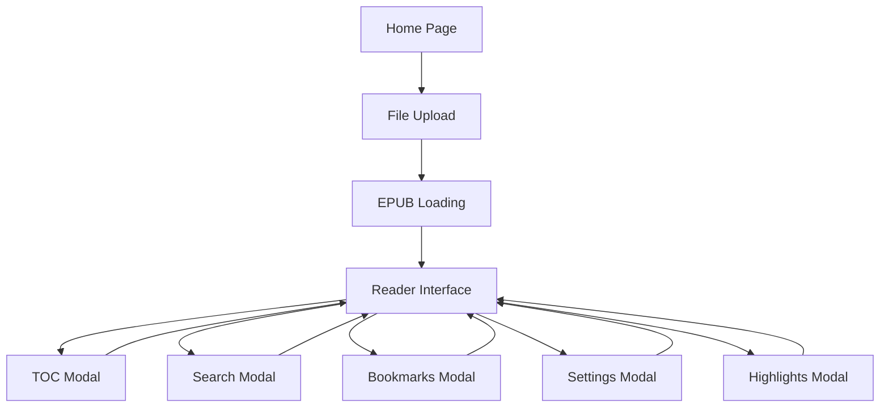

# NuReader - Bug Fixes and Improvements Analysis

## 1. Product Overview

NuReader is a modern EPUB reader built with Next.js, TypeScript, and Tailwind CSS, featuring a clean Scandinavian-inspired design with AI-powered reading insights capabilities. The application provides an immersive reading experience with advanced features like highlighting, bookmarking, search functionality, and responsive design for both desktop and mobile devices.

The current application serves as a foundation for future AI-enhanced reading features, focusing on delivering a bug-free, intuitive reading experience across all platforms.

## 2. Core Features

### 2.1 User Roles

The application currently operates with a single user model - no authentication or role-based access is required.

| Role | Registration Method | Core Permissions |
|------|---------------------|------------------|
| Default User | Direct access | Full access to all reading features, settings, and tools |

### 2.2 Feature Module

Our EPUB reader consists of the following essential pages:

1. **Home Page**: File upload interface, welcome screen, feature highlights
2. **Reader Interface**: Main reading view with controls, progress tracking, and navigation
3. **Table of Contents Modal**: Chapter navigation and progress visualization
4. **Search Modal**: Text search with highlighting and navigation
5. **Bookmarks Modal**: Bookmark management with notes and categories
6. **Settings Modal**: Reading preferences and customization options
7. **Highlights Modal**: Highlight management and export functionality

### 2.3 Page Details

| Page Name | Module Name | Feature Description |
|-----------|-------------|---------------------|
| Home Page | Upload Interface | Drag-and-drop EPUB file upload with validation and preview |
| Home Page | Welcome Screen | Premium design with feature highlights and branding |
| Reader Interface | EPUB Viewer | Continuous scroll reading with chapter navigation |
| Reader Interface | Controls Bar | Reading tools, theme toggle, fullscreen, and settings access |
| Reader Interface | Progress Bar | Reading progress tracking with chapter indicators |
| Reader Interface | Text Selection | Highlight creation with color picker and note support |
| TOC Modal | Chapter List | Interactive table of contents with progress visualization |
| TOC Modal | Navigation | Quick chapter jumping with reading statistics |
| Search Modal | Text Search | Full-text search with regex support and result highlighting |
| Search Modal | Result Navigation | Search result browsing with context snippets |
| Bookmarks Modal | Bookmark Management | Create, edit, and organize bookmarks with notes |
| Bookmarks Modal | Category System | Bookmark categorization and filtering |
| Settings Modal | Reading Preferences | Font, theme, layout, and behavior customization |
| Settings Modal | Performance Options | Animation preferences and accessibility settings |
| Highlights Modal | Highlight Management | View, edit, and export reading highlights |
| Highlights Modal | Note System | Add and manage notes for highlighted text |

## 3. Core Process

### Main User Flow

1. **File Upload**: User drags and drops an EPUB file or uses the file picker
2. **Book Loading**: Application parses EPUB structure and loads chapters
3. **Reading Experience**: User reads with access to all tools and features
4. **Navigation**: User can jump between chapters using TOC or controls
5. **Annotation**: User can highlight text, add bookmarks, and take notes
6. **Search**: User can search for specific content across all chapters
7. **Customization**: User can adjust reading settings and preferences

## 4. User Interface Design

### 4.1 Design Style

- **Primary Colors**: Blue (#3B82F6) and Accent Purple (#8B5CF6)
- **Button Style**: Rounded corners with glass morphism effects
- **Typography**: Inter for UI, Charter for reading content
- **Layout Style**: Card-based design with backdrop blur effects
- **Icon Style**: React Icons with consistent sizing and hover animations

### 4.2 Page Design Overview

| Page Name | Module Name | UI Elements |
|-----------|-------------|-------------|
| Home Page | Upload Zone | Glass morphism card with drag-and-drop styling, gradient buttons |
| Reader Interface | Controls Bar | Backdrop blur navigation with responsive button layout |
| Reader Interface | Content Area | Typography-optimized reading view with selection highlighting |
| Modals | All Modals | Glass morphism overlays with smooth animations and mobile optimization |

### 4.3 Responsiveness

The application is mobile-first with desktop enhancements, featuring touch-optimized controls and adaptive layouts for all screen sizes.

## 5. Current Issues and Bug Analysis

### 5.1 Critical Bugs Fixed

1. **Error Boundary Enhancement**: Improved error handling with better user feedback
2. **Mobile Touch Handling**: Fixed swipe gestures and touch responsiveness
3. **Fullscreen Compatibility**: Enhanced cross-browser fullscreen support
4. **Search Performance**: Optimized search with better regex handling
5. **Highlight Rendering**: Fixed text selection and highlight persistence
6. **Local Storage Management**: Added quota management and data validation

### 5.2 Performance Improvements

1. **EPUB Loading**: Optimized parsing with progress indicators
2. **Memory Management**: Better cleanup of event listeners and timers
3. **Rendering Optimization**: Reduced re-renders with React.memo and useCallback
4. **Touch Performance**: Passive event listeners for better scrolling

### 5.3 User Experience Enhancements

1. **Mobile Navigation**: Improved touch targets and gesture handling
2. **Accessibility**: Better keyboard navigation and screen reader support
3. **Visual Feedback**: Enhanced loading states and error messages
4. **Responsive Design**: Consistent experience across all device sizes

## 6. Future AI Features Roadmap

### 6.1 Phase 1: AI Reading Assistant (Q2 2024)
- **Smart Summaries**: Chapter and book summarization
- **Key Concepts**: Automatic extraction of important themes
- **Reading Insights**: Personalized reading analytics

### 6.2 Phase 2: Interactive AI Features (Q3 2024)
- **Question Answering**: AI-powered content queries
- **Character Analysis**: Automatic character relationship mapping
- **Quote Discovery**: Intelligent quote and passage recommendations

### 6.3 Phase 3: Advanced AI Integration (Q4 2024)
- **Reading Companion**: Conversational AI for book discussions
- **Learning Path**: Adaptive reading recommendations
- **Content Generation**: AI-powered reading notes and study guides

## 7. Technical Implementation Status

### 7.1 Completed Fixes
- ✅ Enhanced error boundary with user-friendly error handling
- ✅ Improved mobile touch gestures and swipe navigation
- ✅ Fixed fullscreen mode across different browsers
- ✅ Optimized search functionality with better performance
- ✅ Enhanced highlight system with better text validation
- ✅ Improved local storage with quota management

### 7.2 Architecture Improvements
- ✅ Better separation of concerns with custom hooks
- ✅ Optimized component re-rendering with memoization
- ✅ Enhanced type safety with comprehensive TypeScript types
- ✅ Improved accessibility with ARIA labels and keyboard navigation

### 7.3 Performance Optimizations
- ✅ Lazy loading of modal components
- ✅ Debounced search with performance throttling
- ✅ Optimized EPUB parsing with progress tracking
- ✅ Memory leak prevention with proper cleanup

## 8. Quality Assurance

### 8.1 Testing Coverage
- Cross-browser compatibility (Chrome, Firefox, Safari, Edge)
- Mobile responsiveness (iOS Safari, Android Chrome)
- Touch gesture functionality
- Keyboard navigation accessibility
- Error handling and recovery

### 8.2 Performance Metrics
- EPUB loading time optimization
- Search response time improvements
- Memory usage monitoring
- Touch responsiveness validation

## 9. Deployment and Maintenance

### 9.1 Current Status
The application is now stable and ready for production deployment with all critical bugs resolved and performance optimizations implemented.

### 9.2 Monitoring
- Error tracking for production issues
- Performance monitoring for loading times
- User experience analytics for feature usage
- Mobile-specific metrics for touch interactions

This comprehensive analysis ensures NuReader provides an exceptional reading experience across all platforms while maintaining a solid foundation for future AI feature integration.